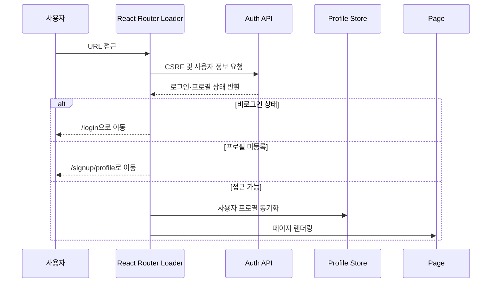

# Frontend Architecture

품결 프론트엔드는 **React 기반 SPA**로, 화면과 도메인 기능을 분리한  
**기능 중심의 계층형 구조**를 사용합니다.

상위 계층은 하위 계층을 조합하며, 여러 기능에서 함께 사용하는 코드는  
`shared`에 모아 중복과 결합도를 줄였습니다.

---

## 1. 전체 구조


애플리케이션은 `main.tsx`에서 시작해 전역 Provider와 Router를 구성하고,  
라우팅된 페이지에서 필요한 도메인 기능을 조합하는 방식으로 동작합니다.

공통 UI와 API Client, Utility는 `shared`에 분리하여  
특정 페이지나 기능에 종속되지 않도록 구성했습니다.

---

## 2. 계층별 역할

| 계층 | 경로 | 역할 |
| --- | --- | --- |
| Entry | `src/main.tsx` | React 애플리케이션을 마운트하고 전역 Provider와 Router를 연결합니다. |
| App | `src/app` | 전역 Provider, 라우트, 인증 및 프로필 접근 제어를 설정합니다. |
| Layout | `src/App.tsx` | 페이지별 Header·Navbar·Splash·Logout UI를 조합합니다. |
| Pages | `src/pages` | 라우트 단위 화면을 구성하고 여러 기능을 연결합니다. |
| Features | `src/features` | 인증, 체크인, 기록, 케어 등 도메인별 UI·상태·API 로직을 관리합니다. |
| Shared | `src/shared` | 공통 컴포넌트, API 클라이언트, 레이아웃, 유틸리티를 제공합니다. |
| Resources | `src/assets`, `src/data` | 이미지·폰트 등의 정적 리소스와 임신 주차 데이터를 보관합니다. |

의존성은 기본적으로 다음 방향을 따릅니다.

```text
main
  ↓
app
  ↓
pages
  ↓
features
  ↓
shared
```

`pages`에서도 공통 UI나 유틸리티가 필요한 경우 `shared`를 직접 사용할 수 있습니다.

```text
pages ─────────→ shared
  │
  └→ features ─→ shared
```

`shared`는 특정 `pages`나 `features`를 참조하지 않습니다.

이를 통해 하위 계층이 상위 계층에 의존하지 않도록 하고,  
공통 코드가 특정 도메인에 종속되는 것을 방지합니다.

---

## 3. 화면 진입과 인증 흐름

품결은 React Router의 `loader`를 활용해  
페이지가 렌더링되기 전에 사용자의 로그인 여부와 프로필 상태를 확인합니다.



### 인증 흐름

```text
URL 접근
   ↓
React Router Loader
   ↓
CSRF / 사용자 정보 조회
   ↓
로그인 상태 확인
   ↓
프로필 등록 상태 확인
   ↓
페이지 접근 또는 Redirect
```

비로그인 상태라면 `/login`으로 이동하고,  
로그인은 되어 있지만 프로필 등록이 완료되지 않은 사용자는 `/signup/profile`로 이동합니다.

모든 접근 조건을 만족하면 사용자 정보를 프로필 Store와 동기화한 뒤  
요청한 페이지를 렌더링합니다.

---

## 4. 상태 관리

품결은 상태의 성격에 따라 관리 도구를 분리합니다.

| 상태 유형 | 도구 | 관리 대상 |
| --- | --- | --- |
| 서버 상태 | TanStack Query | API 응답, 캐시, 요청 상태, 데이터 갱신 |
| 클라이언트 상태 | Zustand | 체크인 단계, 사용자 프로필 등 화면 흐름 상태 |
| 폼 상태 | React Hook Form + Zod | 입력값, 유효성 검사, 제출 상태 |
| URL 상태 | React Router | 현재 페이지, Path Parameter, Query String |

### Server State

서버에서 전달되는 데이터는 **TanStack Query**로 관리합니다.

```text
Component
   ↓
Query / Mutation
   ↓
Feature API
   ↓
Axios
   ↓
Backend
```

이를 통해 서버 응답과 캐시, 로딩 상태, 에러 상태 및 데이터 갱신을  
화면 컴포넌트와 분리해 관리합니다.

### Client State

API 응답과 직접 관련되지 않은 화면 흐름 상태는 **Zustand**를 사용합니다.

예를 들어 체크인은 여러 화면을 순차적으로 이동하는 다단계 흐름이기 때문에  
단계 간 유지가 필요한 상태를 Store에서 관리합니다.

```text
체크인 시작
    ↓
사진
    ↓
바디맵
    ↓
메모
    ↓
감정
    ↓
제출
```

서버 데이터와 화면 내부 상태를 분리함으로써  
API 캐시와 사용자 인터랙션 상태가 서로 불필요하게 영향을 주지 않도록 구성했습니다.

---

## 5. Form Architecture

사용자 입력이 필요한 화면은 **React Hook Form**과 **Zod**를 사용합니다.

```text
User Input
    ↓
React Hook Form
    ↓
Zod Validation
    ↓
Valid Data
    ↓
API Request
```

React Hook Form이 입력값과 폼 상태를 관리하고,  
Zod Schema를 이용해 API 요청 전에 입력값의 유효성을 검증합니다.

이를 통해 UI 컴포넌트 내부에 검증 로직이 반복되는 것을 줄이고  
폼 데이터의 타입 안정성을 유지합니다.

---

## 6. API 통신

도메인별 API 함수는 각 `features/*/api`에 배치합니다.

여러 도메인이 공통으로 사용하는 Axios Client와 인증 관련 설정은  
`shared/api`에서 관리합니다.

```text
Page
  ↓
Feature Component
  ↓
Feature Model / Hook
  ↓
Feature API
  ↓
Shared Axios Client
  ↓
Backend API
```

예시는 다음과 같은 구조입니다.

```text
src/
├── features/
│   ├── checkin/
│   │   ├── api/
│   │   ├── model/
│   │   └── ui/
│   │
│   ├── care/
│   │   ├── api/
│   │   ├── model/
│   │   └── ui/
│
└── shared/
    └── api/
        └── Axios Client
```

API 구현을 UI에서 분리하여 페이지와 컴포넌트가  
HTTP 요청 세부 구현보다 **사용자 인터랙션과 렌더링에 집중**하도록 구성했습니다.

---

## 7. API 인증 및 CSRF

백엔드와의 인증은 공통 Axios Client를 통해 처리합니다.

```text
Frontend
   ↓
CSRF Token 요청
   ↓
Cookie / 인증 정보 포함
   ↓
Axios Client
   ↓
Backend API
```

공통 인증 및 요청 설정을 `shared/api`에서 관리하기 때문에  
각 도메인의 API 함수에서 인증 로직을 반복해서 구현하지 않아도 됩니다.

---

## 8. 프로젝트 구조

```text
src/
├── app/
│   ├── providers/          # 전역 Provider 설정
│   └── router/             # 라우트와 접근 제어
│
├── assets/                 # 이미지, SVG, 폰트 등 정적 리소스
│
├── data/                   # 애플리케이션에서 사용하는 정적 데이터
│
├── features/               # 도메인별 기능 모듈
│   ├── auth/               # 로그인 및 로그아웃
│   ├── camera/             # 피부 사진 촬영 및 이미지 검증
│   ├── care/               # 맞춤 케어카드와 추천 콘텐츠
│   ├── checkin/            # 오늘의 체크인 흐름
│   ├── massage-guide/      # 마사지 가이드
│   ├── mypage/             # 사용자 프로필과 계정 관리
│   ├── records/            # 체크인 기록, 캘린더, 타임라인
│   ├── status/             # 사용자 상태 요약과 차트
│   └── terms-agreement/    # 서비스 약관 동의
│
├── pages/                  # 라우트 단위 페이지
│
├── shared/
│   ├── api/                # 공통 API 클라이언트와 인증 요청
│   ├── components/         # 공통 UI 및 Layout
│   └── lib/                # 공통 Utility
│
├── App.tsx                 # 공통 Layout 및 최상위 화면 흐름
├── index.css               # 전역 스타일과 디자인 토큰
└── main.tsx                # 애플리케이션 진입점
```

---

## 9. 배포 구조

프론트엔드는 별도의 GitHub Actions 배포 파이프라인을 사용하지 않고  
**AWS Amplify**를 통해 빌드 및 배포합니다.

```mermaid
flowchart LR

    Developer[Developer]
    Repository[GitHub Repository]
    Amplify[AWS Amplify]
    Build[Vite Production Build]
    Hosting[Amplify Hosting]
    Browser[User Browser]
    API[Backend API]

    Developer -->|Push| Repository
    Repository -->|Repository 연동| Amplify
    Amplify -->|Build| Build
    Build -->|Deploy| Hosting
    Hosting -->|서비스 제공| Browser
    Browser -->|API Request| API
```



배포 흐름은 다음과 같습니다.

```text
Developer
    ↓ Push
GitHub Repository
    ↓
AWS Amplify
    ↓
Vite Production Build
    ↓
dist
    ↓
Amplify Hosting
    ↓
User Browser
```

AWS Amplify가 GitHub 저장소와 연결되어 코드 변경을 가져오고,  
Vite 프로덕션 빌드를 실행합니다.

빌드 결과물인 `dist`를 Amplify Hosting에 배포하여  
사용자가 웹 브라우저에서 품결 서비스를 이용할 수 있도록 제공합니다.

배포된 프론트엔드는 HTTPS를 통해 별도의 Backend API와 통신합니다.
